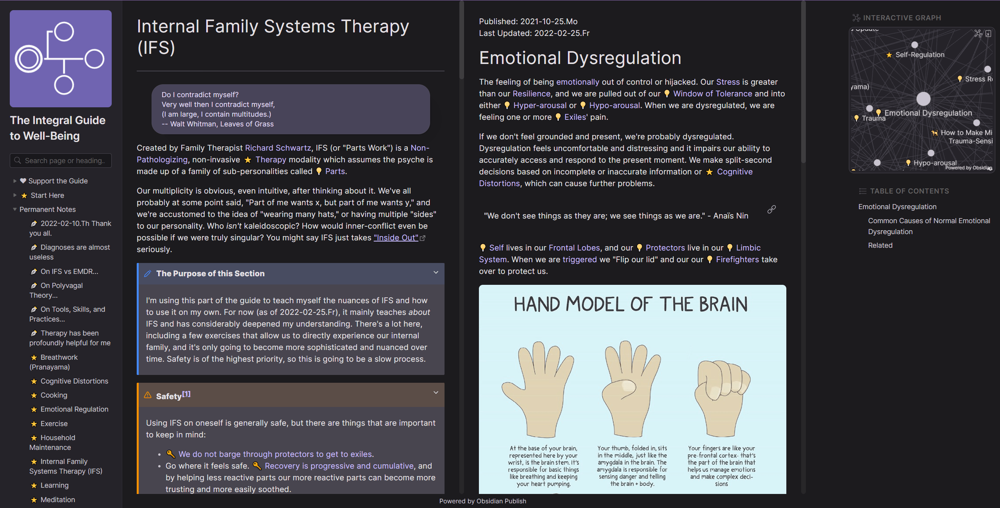

# 📖 (서비스 타이틀)


- 배포 URL : (왠만하면 GitHub Pages로 정적 사이트 배포)

<br>

## 프로젝트 소개

- Blockchain 관련 내용 정리
- Obsidian 기반, Quartz 정적 사이트 배포
  - 마크다운 다루기 어려우면 `Notion` 사용해서 복붙하기

<br>

## Contributors

### Powershell

```powershell
Invoke-Expression (Invoke-WebRequest -Uri "https://gist.githubusercontent.com/ooMia/d44748600e94b0366ec65398125b9c45/raw/1b19a22a19bb1c4c308d634757d435875d46c331/get_github_avatar.ps1").Content
```

### sh/bash

```bash
sh <(curl -s "https://gist.githubusercontent.com/ooMia/afbae4f3249609e0bf17e4b6c7baa696/raw/ada8812c56d056dc15f71fc6973bdf501ea0a6f0/get_github_avatar.sh")
```

|                                                     Option #1: GitHub-Profile <br/> oomia                                                      |                                                       Option #2: Local-Profile <br/> mia                                                       |
| :--------------------------------------------------------------------------------------------------------------------------------------------: | :--------------------------------------------------------------------------------------------------------------------------------------------: |
| [ <br/> @GitHub-Nickname](https://github.com/GitHub-Nickname) | [ <br/> @oomia](https://github.com/oomia) |

<br>

## 1. Environments

-
- 버전 및 이슈관리 : Github, Github Issues, Github Project
- 협업 툴 : Discord, GitHub Project
- 서비스 배포 환경 : GitHub Pages (또는 AWS EC2)
-

  <br>

## 2. 채택한 개발 기술과 브랜치 전략

### Quartz

아직 자세히 보지는 않았고, Obsidian deploy처럼 GitHub Pages로 정적 사이트 생성 지원한다고 해서 조사 중
(만약 잘 안 되면, 우선 Obsidian 내장 기능 사용하고, 방법 찾아서 변경 예정)

### 브랜치 전략

- `develop` 브랜치에서부터 본인 닉네임으로 브랜치 생성 (e.g. `@ooMia`)


<br>

## 3. 프로젝트 구조

- Windows CMD에서 `tree /F | clip` 명령어 사용

```
│  .gitignore
│  LICENSE
│  README.md
│
├─concepts
│  │  *.md
│  │
│  ├─Blockchain
│  │      Archive Node.md
│  │      Bitcoin.md
│  │      Block.md
│  │      Blockchain.md
│  │      Ethereum.md
│  │      Mainnet.md
│  │      Merkle tree.md
│  │      Node.md
│  │      Smart Contract.md
│  │      Testnet.md
│  │      Timestamp.md
│  │
│  ├─Consensus
│  │      Blockchain Trilemma.md
│  │      Consensus.md
│  │      Mempool.md
│  │      Mining.md
│  │      Nonce.md
│  │      PoS.md
│  │      PoW.md
│  │      Staking.md
│  │
│  ├─Cryptocurrency
│  │      Cryptocurrency.md
│  │
│  ├─Cryptography
│  │      Cryptography.md
│  │      Zero Knowledge Proof.md
│  │
│  ├─DeFi
│  │      AMM.md
│  │      DeFi.md
│  │
│  ├─Ethereum
│  ├─Finance
│  │      Finance.md
│  │
│  ├─Layer2
│  │      Bridge.md
│  │      Layer1.md
│  │      Layer2.md
│  │      Optimism.md
│  │      Rollup.md
│  │
│  ├─Misc
│  │      Mixer.md
│  │      Security Audit.md
│  │      Tornado.Cash.md
│  │      Web3.md
│  │
│  └─Regulation
│          Regulation.md
│
└─embed
    │  .gitignore
    │
    └─img
```

<br>

## 4. 역할 분담

- 주제별 또는 담당 개념별로 적으면 될 듯

### 🍊이름

- **파트**
  - 내용
    <br>

## 5. 개발 기간 및 작업 관리

### 개발 기간

- 한 주는 전체적으로 점검하고 마무리해야 하고, 프로젝트 기간 시작 전까지는 모든게 끝나야 하므로 실질적인 작업은 9월 전에 종료

- 전체 개발 기간 : 

<br>

### 작업 관리

- CONTENT
  <br>

## 6. 신경 쓴 부분

- 링크

<br>

## 7. 페이지별 기능

### [초기화면]

- DESCRITPION : README 초기화면입니다.

| 초기화면 (예시)                      |
| ------------------------------------ |
|  |

<br>

<br>

## 8. 트러블 슈팅

- 링크

<br>

## 9. 개선 목표

- 문제 -> 할 일 -> 결과

<br>

## 10. 프로젝트 후기

### 🍊 이름

- 후기
